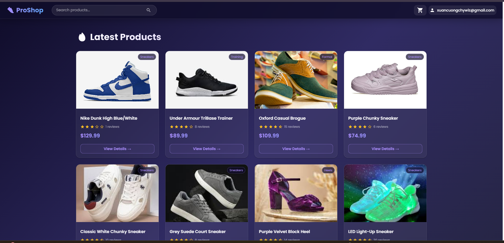
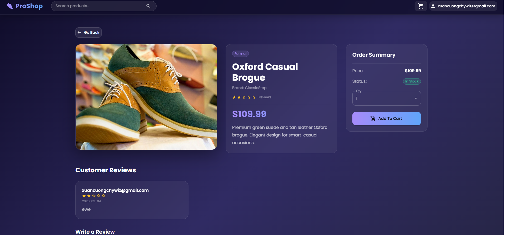
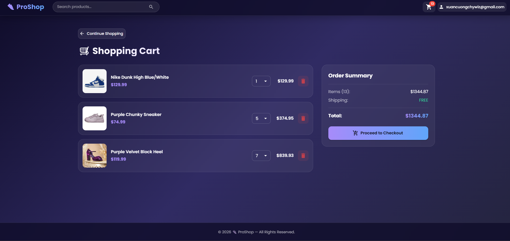
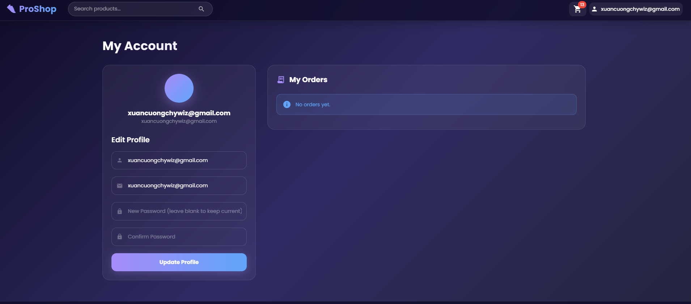
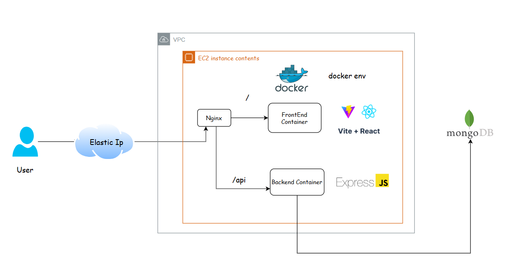
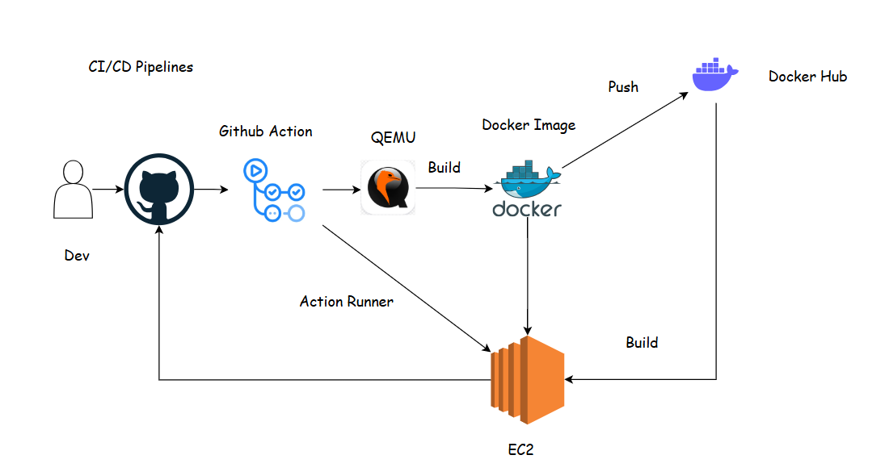

# 👟 ProShop — Full-Stack E-Commerce on AWS EC2

> Deployed full-stack e-commerce application on AWS EC2 (ARM64 Graviton), implemented CI/CD with GitHub Actions (Buildx multi-arch), Dockerized services, configured Nginx reverse proxy, and automated production deployment using self-hosted runners.

---

## 📸 Application Screenshots


| Home Page | Product Detail |
|-----------|---------------|
|  |  |

| Cart | Profile |
|------|---------|
|  |  |

---

## 🏗️ Architecture Diagram






---

## 🛠️ Tech Stack

| Layer | Technology |
|-------|-----------|
| Frontend | React 18, Vite, MUI v5, Redux Toolkit |
| Backend | Node.js, Express, MongoDB, Mongoose |
| Auth | JWT (JSON Web Tokens) |
| Containerization | Docker, Docker Compose |
| Reverse Proxy | Nginx |
| CI/CD | GitHub Actions, Docker Buildx |
| Cloud | AWS EC2 (ARM64 Graviton) |
| Registry | Docker Hub |

---

## ⚙️ CI/CD Pipeline

```
Push to main
     │
     ▼
GitHub Actions (ubuntu-latest)
     │
     ├── Install dependencies
     ├── Set up QEMU + Docker Buildx
     ├── Build backend image (linux/arm64)
     ├── Build frontend image (linux/arm64)
     └── Push to Docker Hub
          │
          ▼
     Self-Hosted Runner (EC2)
          │
          ├── Pull latest images
          ├── docker compose up -d
          └── Prune old images
```

---

## 🚀 Getting Started

### Prerequisites
- Node.js v20+
- Docker & Docker Compose
- MongoDB Atlas account

### Local Development

```bash
# Clone the repo
git clone https://github.com/chywiz/e-commerce-mern-stack.git
cd e-commerce-mern-stack

# Backend
cd backend
npm install
npm run dev

# Frontend (new terminal)
cd frontend
npm install
npm run dev
```

### Docker (Production)

```bash
# Build and run all services
docker compose up --build

# Seed the database
docker exec -it <backend-container> node seeder.js
```

---

## 🔑 Environment Variables

Create a `.env` file in the `backend/` folder:

```env
NODE_ENV=production
PORT=5000
MONGO_URI=your_mongodb_connection_string
JWT_SECRET=your_jwt_secret
FRONTEND_URL=http://your-ec2-ip
```

---

## 🐳 Docker Images

| Image | Docker Hub |
|-------|-----------|
| Backend | `chywiz/e-app-backend:latest` |
| Frontend | `chywiz/e-app-frontend:latest` |

---

## 📁 Project Structure

```
e-commerce-mern-stack/
├── backend/
│   ├── config/
│   ├── controllers/
│   ├── data/
│   ├── middleware/
│   ├── models/
│   ├── routes/
│   ├── Dockerfile
│   └── server.js
├── frontend/
│   ├── public/images/
│   ├── src/
│   │   ├── actions/
│   │   ├── components/
│   │   ├── constants/
│   │   ├── reducers/
│   │   └── screens/
│   ├── Dockerfile
│   └── nginx.conf
├── .github/
│   └── workflows/
│       └── deploy.yml
└── docker-compose.yml
```

---

## 🔧 GitHub Actions Secrets Required

| Secret | Description |
|--------|-------------|
| `DOCKER_USERNAME` | Docker Hub username |
| `DOCKER_PASSWORD` | Docker Hub password |

---

## 📝 License

MIT © [chywiz](https://github.com/chywiz)
