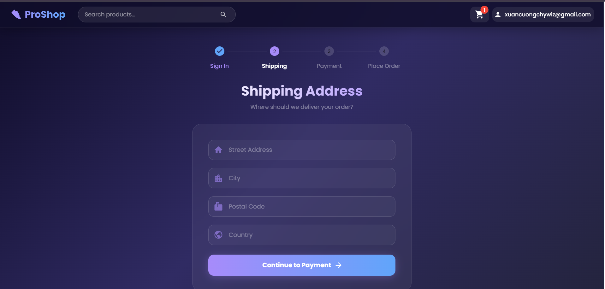
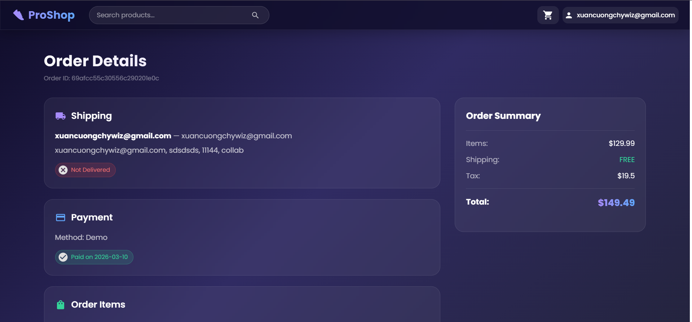

# 👟 ProShop — Full-Stack E-Commerce on AWS EC2

> Deployed full-stack e-commerce application on AWS EC2 (ARM64 Graviton), implemented CI/CD with GitHub Actions (Buildx multi-arch), Dockerized services, configured Nginx reverse proxy, and automated GitOps deployment using ArgoCD on k3s.

---

## 📸 Application Screenshots


| Home Page | Product Detail |
|-----------|---------------|
|  |  |

| Cart | Profile |
|------|---------|
|  |  |

| Checkout | Order |
|----------|-------|
|  |  |

---

## 🏗️ Architecture Diagram


 

---

## 🛠️ Tech Stack

| Layer | Technology |
|-------|-----------|
| Frontend | React 18, Vite, MUI v5, Redux Toolkit |
| Backend | Node.js, Express, MongoDB, Mongoose |
| Auth | JWT |
| Containerization | Docker, Docker Compose |
| Reverse Proxy | Nginx/Traefik |
| CI/CD | GitHub Actions, Docker Buildx (ARM64) |
| GitOps | ArgoCD on k3s |
| Cloud | AWS EC2 (ARM64 Graviton) |
| Registry | Docker Hub |
| Terraform
---

## ⚙️ Environments

### 🧪 Development — Docker Compose
```bash
# Run all services locally
docker compose up --build

# Seed the database
docker exec -it <backend-container> node seeder.js
```

| Service | URL |
|---------|-----|
| Frontend | http://localhost:3000 |
| Backend | http://localhost:5000 |
| MongoDB | localhost:27017 |

### 🚀 Production — k3s + ArgoCD

```
Push to main (backend/** or frontend/**)
        │
        ▼
GitHub Actions
        ├── Build backend  → chywiz/e-app-backend:<sha>   (linux/arm64)
        ├── Build frontend → chywiz/e-app-frontend:<sha>  (linux/arm64)
        ├── Push images to Docker Hub
        ├── Update k8s/backend/backend-deployment.yaml
        ├── Update k8s/frontend/frontend-deployment.yaml
        └── git commit [skip ci] & push
                 │
                 ▼
        ArgoCD (k3s on EC2)
                 ├── Detects manifest change
                 ├── Pulls new image:<sha>
                 └── Rolls out new deployment
```

---

## 📁 Project Structure

```
e-commerce-mern-stack/
├── backend/
│   ├── config/
│   ├── controllers/
│   ├── data/
│   ├── middleware/
│   ├── models/
│   ├── routes/
│   ├── Dockerfile
│   └── server.js
├── frontend/
│   ├── public/images/       ← product images
│   ├── src/
│   │   ├── actions/
│   │   ├── components/
│   │   ├── constants/
│   │   ├── reducers/
│   │   └── screens/
│   ├── nginx.conf
│   └── Dockerfile
├── k8s/
│   ├── backend/
│   │   ├── backend-deployment.yaml   ← image tag auto-updated by CI
│   │   └── backend-service.yaml
│   ├── frontend/
│   │   ├── frontend-deployment.yaml  ← image tag auto-updated by CI
│   │   └── frontend-service.yaml
│   └── ingress.yaml
├── infra/
│   └── terraform/
│       ├── main.tf                   ← EC2 instance (ARM64 Graviton)
│       ├── variables.tf              ← input variables
│       ├── outputs.tf                ← EC2 public IP, instance ID
│       ├── provider.tf               ← AWS provider config
├── .github/
│   └── workflows/
│       └── deploy.yml
├── docker-compose.yml        ← dev only
└── README.md
```

---

## 🔑 Environment Variables

Create `.env` in `backend/`:

```env
NODE_ENV=production
PORT=5000
MONGO_URI=your_mongodb_connection_string
JWT_SECRET=your_jwt_secret
FRONTEND_URL=http://your-ec2-ip
```

For k3s, apply the secret manually on EC2:
```bash
kubectl apply -f k8s/backend/backend-secret.yaml
```

---

## 🔧 GitHub Secrets Required

| Secret | Description |
|--------|-------------|
| `DOCKER_USERNAME` | Docker Hub username |
| `DOCKER_PASSWORD` | Docker Hub password |

---

## 🛍️ Features

- ✅ Product listing with search & pagination
- ✅ Product detail with reviews & ratings
- ✅ Shopping cart with quantity management
- ✅ User authentication (JWT)
- ✅ Checkout flow (Shipping → Payment → Order)
- ✅ Demo payment simulation
- ✅ Admin panel (Products, Users, Orders)
- ✅ Responsive glassmorphism UI
- ✅ Dockerized with Nginx reverse proxy
- ✅ CI/CD with GitHub Actions (ARM64 Buildx)
- ✅ GitOps with ArgoCD on k3s

---

## 📝 License

MIT © [chywiz](https://github.com/chywiz)
